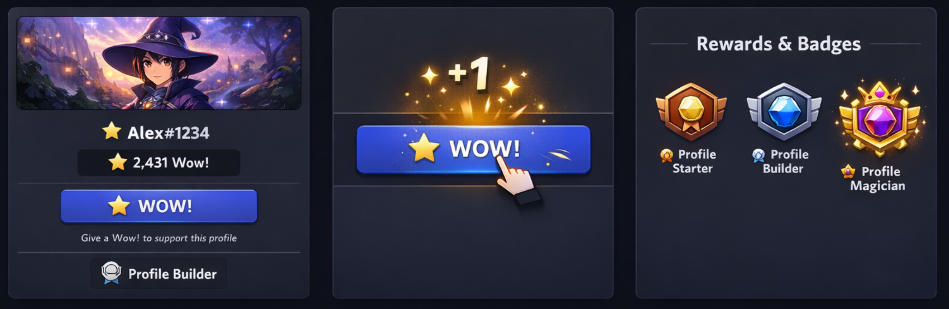

#   Profile Engagement System

> A product concept designed to increase engagement, identity, and interaction in Discord profiles.

---

## Preview

---

## Live Demo

[🖱️​ OPEN](https://agustincmp.github.io/D-P-E-S/)

---

## The Idea

What if Discord profiles were MORE interactive?

This system introduces a simple mechanic:

🏮​ Users can give a daily “Wow!” to profiles  
🏮​ Users unlock badges and recognition  
🏮​ Users gain rewards  

All users can participate.  
Nitro enhances the experience.

---

## 🧩 Core Features

- Positive-only reaction system  
- Visible progression (Wow! count)  
- Badge system (Starter → Builder → Magician)  
- aesthetic items (?)  
- Anti-abuse mechanisms  

---

  
Design Thinking 🖱️

𝘼 𝙥𝙚𝙧𝙝𝙖𝙥𝙨:
Profiles are static and lack interaction.

𝙄𝙣𝙨𝙞𝙜𝙝𝙩:
Users seek recognition and identity.

𝙃𝙮𝙥𝙤𝙩𝙝𝙚𝙨𝙞𝙨:
Visible positive feedback increases engagement.

𝘼𝙣 𝙪𝙥𝙜𝙧𝙖𝙙𝙚:
A lightweight reaction + progression system.

𝙄𝙢𝙥𝙖𝙘𝙩:
- Engagement ↑  
- Retention ↑  
- Monetization ↑  
  

---

## Why might it work?

This system combines:

- Social validation  
- Gamification  
- Identity expression  

> 𝗪𝗶𝘁𝗵𝗼𝘂𝘁 𝗶𝗻𝘁𝗿𝗼𝗱𝘂𝗰𝗶𝗻𝗴 𝘁𝗼𝘅𝗶𝗰𝗶𝘁𝘆

---

## Full Proposal

<a href="https://github.com/AgustinCMP/D-P-E-S/blob/main/proposal.pdf" target="_blank">
🖱️ OPEN
</a>

---

## Author

Concept by 𝘼𝙜𝙪𝙨𝙩í𝙣𝘾𝙈𝙋 – 2026

---

## 👁️‍🗨️​ 

𝗧𝗵𝗶𝘀 𝗶𝘀 𝗮 𝗰𝗼𝗻𝗰𝗲𝗽𝘁𝘂𝗮𝗹 𝗽𝗿𝗼𝗱𝘂𝗰𝘁 𝗱𝗲𝘀𝗶𝗴𝗻 𝗽𝗿𝗼𝗽𝗼𝘀𝗮𝗹 𝗶𝗻𝘁𝗲𝗻𝗱𝗲𝗱 𝗳𝗼𝗿 𝗱𝗶𝘀𝗰𝘂𝘀𝘀𝗶𝗼𝗻 𝗮𝗻𝗱 𝗶𝗻𝘀𝗽𝗶𝗿𝗮𝘁𝗶𝗼𝗻.

---
## License

This project is licensed under the  
**Creative Commons BY-NC-ND 4.0 License**.

You may view and share this work with attribution, but you may not use it commercially or modify it.

© 2026 [AgustínCMP/Lena]
